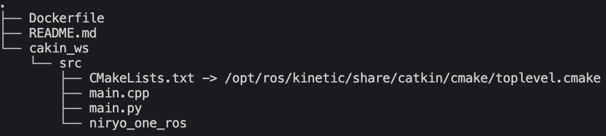

### Development Guide
---
1. Open terminal.
2. Clone the project and go to the directory: `prompt2act`.
```
$ git clone https://github.com/thisiselijah/prompt2act.git && cd prompt2act
```
3. Build the docker image.
```
$ docker build -t ros-kinetic-dev .
$ docker build -t ros-noetic-dev .
```
4. Run the image with container name.
```
$ docker run -it --rm --name <container-name> ros-kinetic-dev # run kinetic 
$ docker run -it --rm --name <container-name> ros-noetic-dev # run noetic
```
5. Open the other terminal in the identical directory(`prompt2act`).

   Then, copy the Niryo One package to your host.(This step is optional.)
```
docker cp [your-container-name]:/root/catkin_ws/src/. ./catkin_ws/src/
```
6. Now, the directory may seem like the following:

7. Stop the container and restart it.  
```
$ docker run -it --rm --name <container_name> -v ./catkin_ws/src:/root/catkin_ws/src ros-kinetic-dev
$ docker run -it --rm --name <container_name> --net=host --device=/dev/video0:/dev/video0 -v ./catkin_ws/src:/root/catkin_ws/src ros-noetic-dev
```
<p style="color:red; font-weight: bold; font-size: 14pt;">
以上步驟可能還會修改!
</p>

### Compile
---
```
!bash
$ source /opt/ros/kinetic/setup.bash && source ~/catkin_ws/devel/setup.bash && catkin_make
$ roslaunch <package_name> <launch_file> # launch all nodes 
$ rosrun # launch specific node
```


### References
---
https://gitcode.com/gh_mirrors/ni/niryo_one_ros/?utm_source=artical_gitcode&index=bottom&type=card&webUrl
